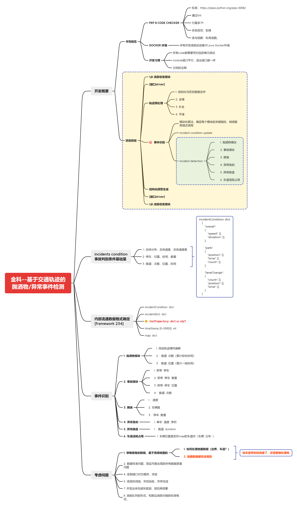

# spill-detection
核心功能为抛洒物检测。

## 1. 数据说明
**数据来源**：金科院
<br>
**数据场景**：南京高速
<br>
**路段长度**：约400m
<br>
**采集设备**：雷达
<br>
**帧率**：20FPS
<br>
**开始时间戳**：2023-10-20 10:03:41.883
<br>
**开始帧数**：62748

### 数据格式
离线模拟场景：从txt文件读取接受
<br>
每帧传来数据为list，list元素为代表目标信息的dict，即：
<br>
第n帧： [car1, car2, ...]
<br>
各car目标的dict形式为：
<br>
TargetId | XDecx | YDecy | ZDecz | VDecVx | VDecVy | Xsize | Ysize | TargetType | Longitude | Latitude | Confidence | EventType | LineNum | Frame
<br>

#### 数据传输格式
参见文档<a href="./docs/data_format.txt" >数据格式</a>


#### 数据内容说明
**targetType**：0-未定义目标，1-小车，2-大车，3-摩托，4-自行车，5-行人

**距离单位**：m

**速度单位**：m/s

## 2. 思维导图
<p>

</p>

## 3. 算法逻辑

<p>

</p>

## 4. 工作流程
### 4.1 确定detection layer数据格式
laneid从1开始（与传输数据保持一致）
cellOrder从0开始（方便调用不用再做处理）
列出所有需要的参数，参数数据结构。
<p>
traffic变量
</p>

### 4.2 数据准备

 源于组内轨迹数据。从组内轨迹数据写一个直接对接内部数据格式的转换文件。

### 4.3 detection layer算法开发

 算法开发
 算法可行性验证
 对内部流通数据格式调整
 确定最终内部数据流通格式

### 4.4 整体算法结构开发

### 4.5 文件名尽量用英文

```python

    info1: dict = {
        "a": 1,
        "b": 2,
        "c": 3,
    }

    info2 = [1, 2]

    def func1(**kws):
        pass
        xxx = a

    def func2(a, b):
        pass

    func1(**info)
    func2(*info2)

	# **keywords 按dict展开赋值
	# *keywords 按list展开复制

```


```python

args = parser()

self.args = args

self.args.kw1
self.args.kw2

self.conditions.speed


```

# note!
车道线将不再用于确定cell等功能。<br>
cell将直接根据y坐标确定。<br>
横向速度将直接根据x计算。<br>