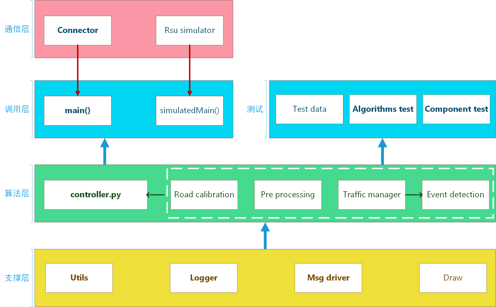
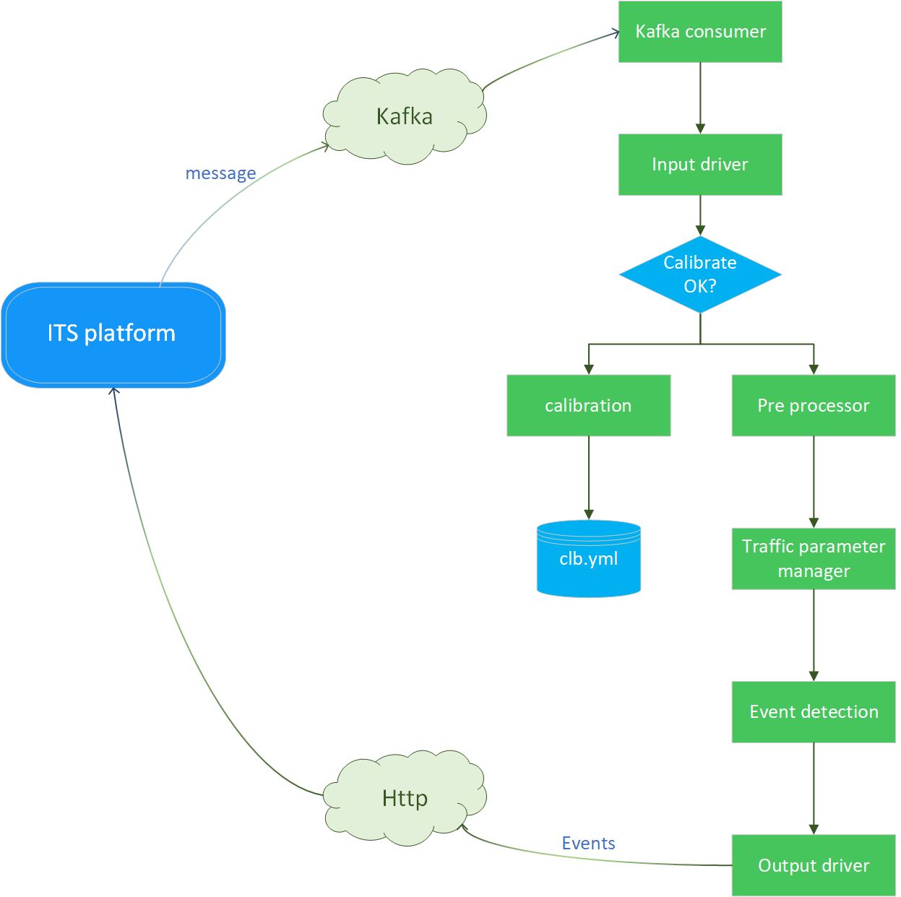

# spill-detection
构建高速公路异常事件检测交通处理模型：采用运行轨迹特征判断、交通行为判断方法，对视频可观察到的路面抛洒物事件以及引起的事故事件进行检测；对视频不可观察的异常条件下拥堵异常行为进行异常检测。 
**核心功能为抛洒物检测。**

## 1. 数据说明
### 1.1 数据说明
**数据来源**: 金科院，南京绕越高速管理中心 
**数据场景**: 南京绕越高速 
**采集设备**: 雷达 
**帧率**: 20FPS
### 1.2 样本数据
**路段长度**: 约400m 
**开始时间戳**: 2023-10-20 10:03:41.883 
**开始帧数**: 62748

### 1.3 样本数据格式
离线模拟场景: 从txt文件读取接受 
每帧传来数据为list, list元素为代表目标信息的dict, 即:  
第n帧:  [car1, car2, ...] 
各car目标的dict形式为:  
TargetId | XDecx | YDecy | ZDecz | VDecVx | VDecVy | Xsize | Ysize | TargetType | Longitude | Latitude | Confidence | EventType | LineNum | Frame 
### 1.4 部署数据格式
外层：{deviceID, deviceType, targets} 
其中target的字段为 
timestamp | id | lane | y | x | cls | speed | vx | vy | latitude | longitude
### 1.5 数据协议
参见文档<a href="./docs/data_protocol.txt" >数据协议</a>

## 2. 检测事件类别
共检测8类事件。 
["spill", "stop", "lowSpeed", "highSpeed", "emergencyBrake", "incident", "crowd", "illegalOccupation"] 
抛洒物，停车，低速行驶，超速行驶，急刹车，车辆事故，拥堵，非法占用应急车道

## 3. 算法逻辑

## 4. 项目架构

## 5. 数据通道

