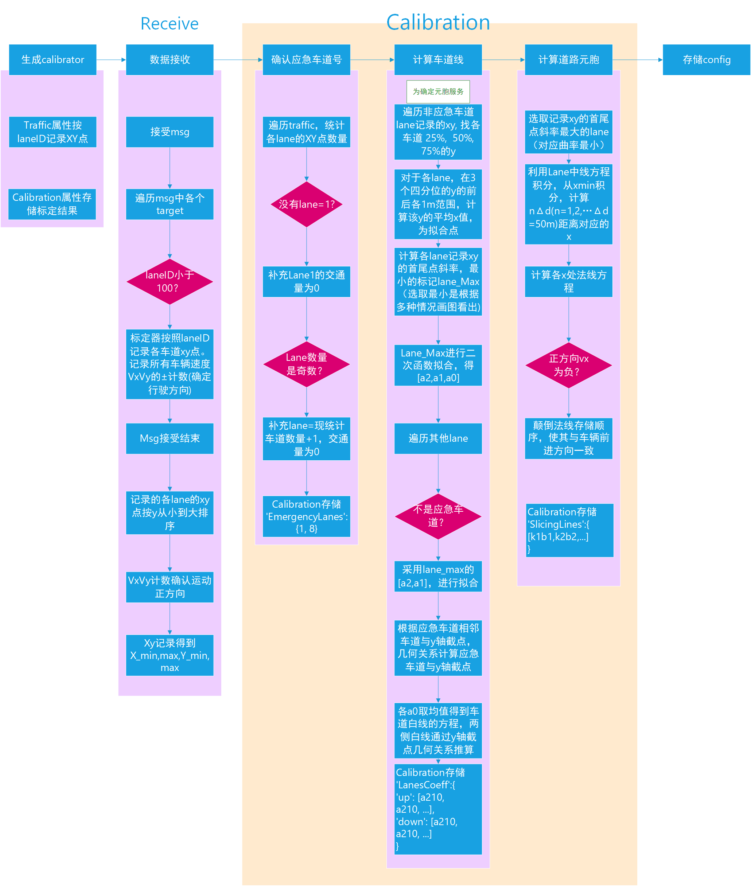

# 标定
在正式运行前，在具有一定交通量的一段时间内，运行标定过程。
 
标定过程将得到：**车道线方程，抛洒物检测有效片区，应急车道编号**。
 

# config格式

    {
    	'EmergencyLanes':{1, 8},
		
    }

# 车道线计算分析
**车道线计算是为了划分元胞。**暂无其他用途 
从xy散点图中可以看出，5-8lane的轨迹长度更长，能体现出更明显的二次函数性质，而1-4车道则没办法体现出明显的二次函数性质。如果直接对各个lane独立地去拟合出车道中心线的二次函数，会导致1-4号车道拟合的结果更像是一个一次函数，这与实际情况不符，并且不能与5-8号车道的曲率保持一致。
 

基于此分析，应当先对远处的5-8号，更准确的说采用具有最长轨迹距离的8号车道，先进行二次函数拟合，得到最明显，最贴合实际道路曲率的二次函数系数。之后固定二次函数的x^2和x的系数，让这样的二次函数曲线系去拟合其他车道，从而1-8车道得到不同的截距。
 
上述分析会发现，我们在预热标定阶段，也需要对 <s>各个车道上所有车辆的行驶距离进行记录,</s> 
<s>找到哪个车道的y值变化范围最大,</s>(因为考虑可能y值变化大的是直的) 
**找到哪个车道最大最小y值连线的斜率绝对值最大，** 
从而找到哪个lane具有最长的，二次函数最明显的特征。
（上述原理未及时更新2023.12.19）

## 应急车道计算原理
根据内外侧的lane的车道线方程，去向外推算两个应急车道的方程（都是指车道中线方程） 
首先比较除非应急车道外的2个边界车道方程（称为内外侧车道）的常数项，对于常数项大的那个lane，推算其相邻应急车道时，常数项+某一数值向上推演；对于常数项小的那个lane，推算其相邻应急车道时，常数项+某一数值向下推演。 
分别对于内外侧的车道方程： 
1. 计算车道线在x=0处的导数值，即车道线在y轴交点处的斜率k。 
2. 计算y轴交点的法线方程斜率-1/k。 
3. 计算（普通车道+应急车道）/2的车道宽度d，近似为边界车道和应急车道在y轴附近的垂直距离。 
4. 根据几何关系，推导出上述某一数值Δb = d / cosα，其中α为切线的切角（tanα=k），即有 
Δb = d * sqrt(1+k^2) 
5. 再去计算应急车道的截距，就ok了。 

# 代码实现逻辑

