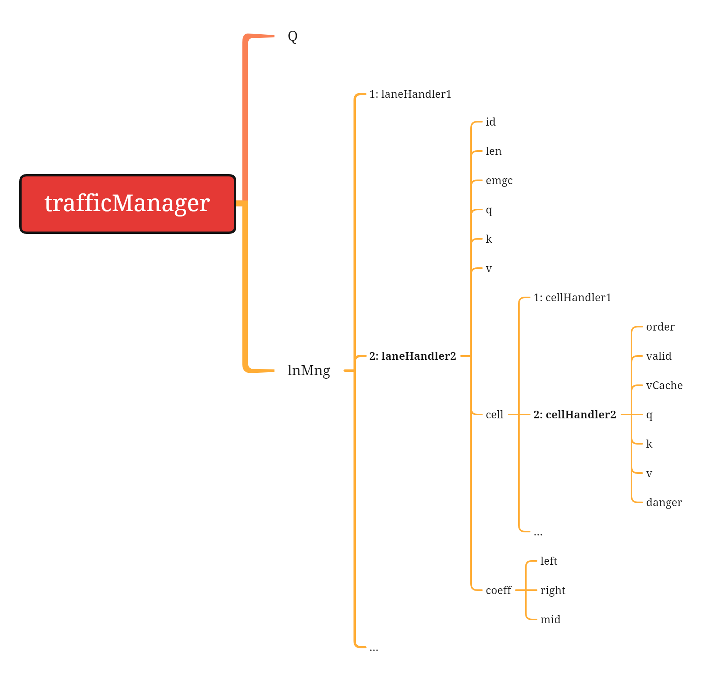

# 说明
根据实时接受的数据，实时计算宏观中观交通流。

# 交通流计算方法
## 参数单位
密度: v/km/ln或v/km，每车道每千米的车辆数
速度: km/h, 车辆的平均通行速度
流量: v/h/ln或v/h, 每车道的通行流量

## 整体方法
参考：http://t.csdnimg.cn/efq2J
密度k的计算，k需要对指定范围的车辆进行计数，并知道路段长度即可。 
路段速度v，需要车辆的微观数据vy(同时也要保留vx)，要根据每辆车的速度进行计算，路段平均速度取算数平均值。 
路段流量q，不能直接统计车辆数量即在行车辆数作为q，而要根据q=k*v计算。

## 运算流程

# 需考虑的时间参数
## 如何选择采样时间的长度?
 根据此来计算1h的交通流量? 
参数记为: 计算持续时间q cal duration(=5min?) 

## 交通流参数的更新计算
频率都每接受1帧msg，就更新一次流密速? 
还是持续性接受，每隔一定时间更新计算一次? 
参数记为: 计算时间间隔cal interval= 30s?  

## 交通密度的计算需要车道长度
calibration过程得到

